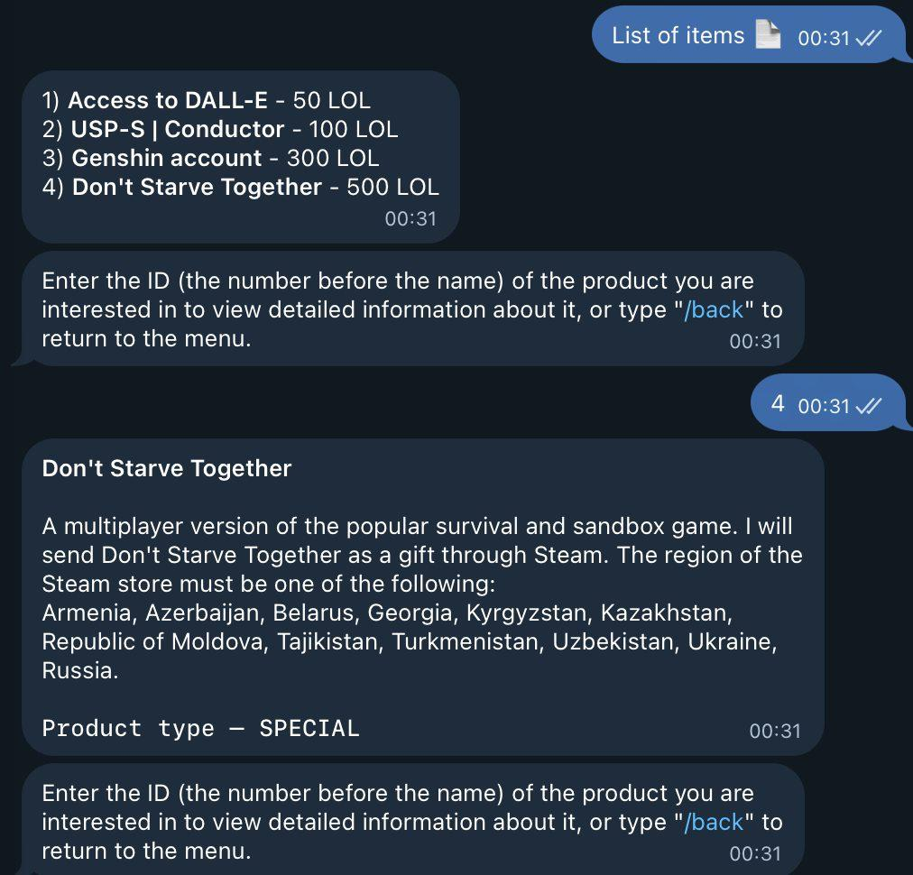
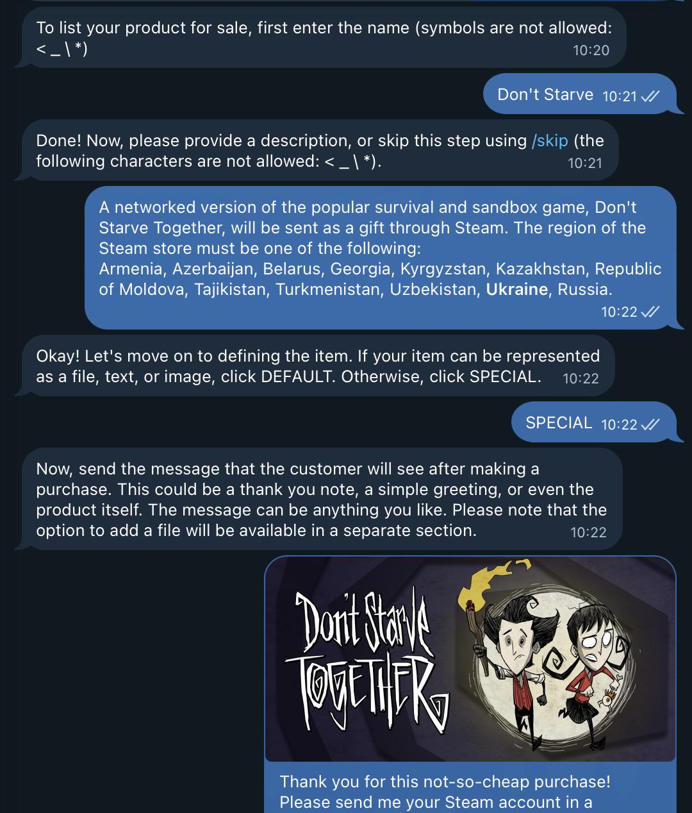

# Lolcoin Workplace

Lolcoin Workplace was a Telegram marketplace built in 2022 for a small summer camp community. Members could sell digital goods to one another using Lolcoin: the bot kept account balances, displayed listings, delivered goods that could be sent through Telegram, and handled purchases that required the buyer to confirm receipt.

## Screenshots

  
  

## How it worked

### Accounts and balances

The community's Lolcoin wallet addresses were matched to Telegram users in a PostgreSQL database. I prepared the user records manually; on first contact, the bot checked whether it could recognize the user's Telegram account. Unrecognized users could contact an administrator through `/report`.

To deposit funds, a member transferred Lolcoin to the platform's account. Every 60 seconds, the bot checked the historical NEAR Explorer for new transactions, ignored transaction URLs it had already processed, matched the sender's wallet to a user, and credited that user's in-bot balance. Deposits had to be at least 2 Lolcoin; the platform deducted a 1 Lolcoin fee. Balances were stored in integer hundredths of a Lolcoin.

Purchases used these internal balances. Members could also request a withdrawal to their registered wallet through the external Lolcoin transfer service.

### Listings and purchases

Sellers created listings through a guided Telegram conversation: title, optional description and picture, product type, price, and optionally a limit on the number of buyers. Buyers browsed the shared catalogue, opened a listing, and confirmed the purchase.

| Product type | What happened after purchase |
| --- | --- |
| `DEFAULT` | The bot deducted the buyer's balance, credited the seller, and forwarded the seller's saved message and optional file to the buyer. |
| `SPECIAL` | The bot deducted the buyer's balance but did not credit the seller yet. The buyer and seller arranged delivery directly using the contact shared through the bot. After receiving the product, the buyer confirmed it in the **Current transactions** menu, and the bot credited the seller. |

While a `SPECIAL` transaction was awaiting confirmation, the seller could cancel it and the bot would return the amount to the buyer. The bot also tracked the remaining quantity for listings with a limited number of sales.

### Administration

Users could send a report with `/report`; the bot forwarded it to an administrator along with identifying information. An administrator could remove a listing with the restricted `/del` command. Account and wallet registration was done directly in the database rather than through the Telegram interface.

## Code

- `main.py` — Telegram menus and conversation states, product listings, purchases, internal balances, administrative commands, and the periodic deposit check. Built with **aiogram 2**, and **PostgreSQL** (`psycopg2`).
- `transactions_parser.py` — finds incoming transfers by parsing pages from the historical NEAR Explorer and tracks processed transaction URLs.
- `sending_script.py` — requests withdrawals through the external Lolcoin transfer service.

## Status

This repository preserves the 2022 implementation. The deposit parser depends on an older NEAR Explorer's HTML, and withdrawals depend on a separate external service; these integrations are no longer valid and unsuitable for current use.
